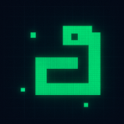
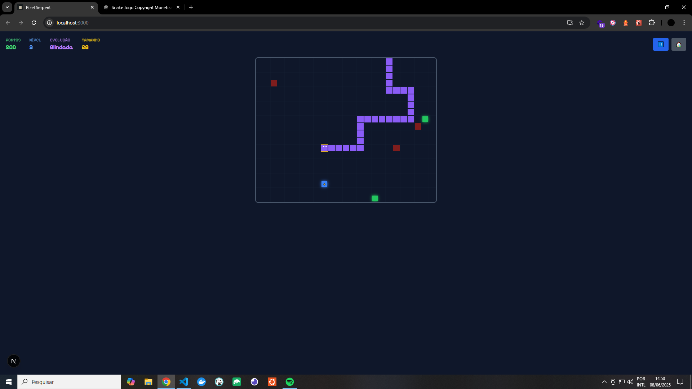
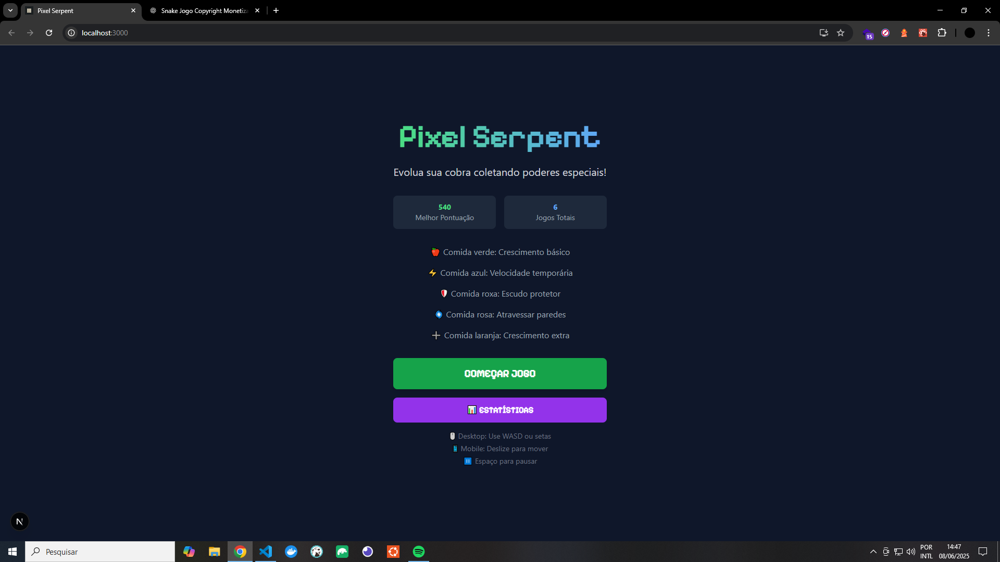
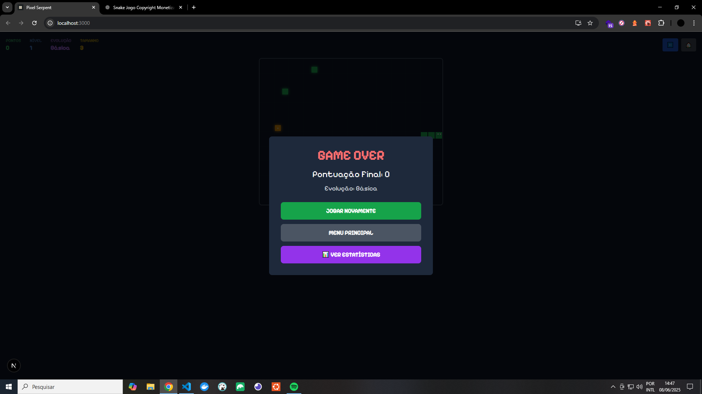
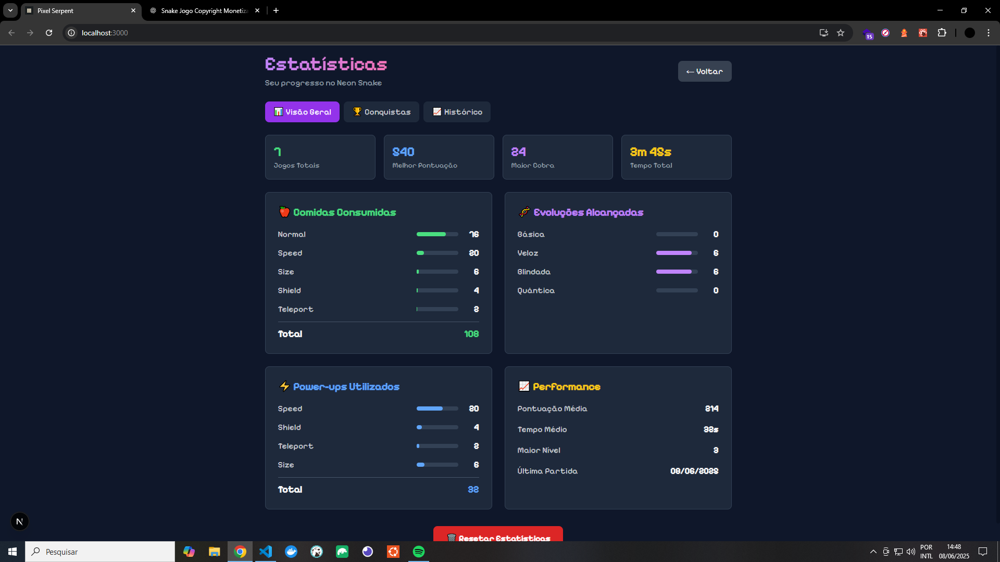
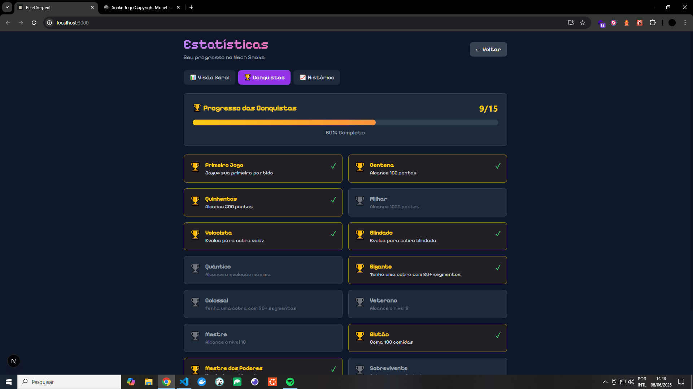
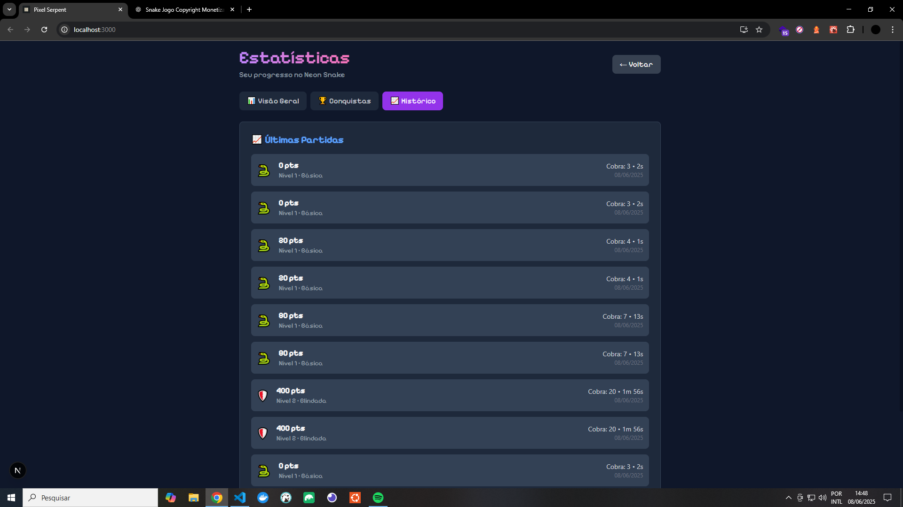

[](https://twitter.com/t_h_e_u)
[](https://www.linkedin.com/in/matheusgbatista/)
[](https://t-heu.github.io)

## Getting Started

First, run command:

```bash
npm install
```

Second, run the development server:

```bash
npm run dev
```

Open [http://localhost:3000](http://localhost:3000) with your browser to see the result.

## Learn More



É o Snake clássico reimaginado para a era moderna! 🐍✨

## **Mecânicas Evolutivas Únicas:**

- **4 Estágios de Evolução**: Básica → Veloz → Blindada → Quântica
- **5 Tipos de Comida Especial**:

- 🍎 Verde: Crescimento normal
- ⚡ Azul: Boost de velocidade
- 🛡️ Roxa: Escudo protetor
- 🌀 Rosa: Atravessar paredes
- ➕ Laranja: Crescimento extra

## 🎮 **Controles Intuitivos:**

- **Desktop**: WASD ou setas do teclado
- **Mobile**: Swipe para mover + botões de controle
- **Universal**: Espaço para pausar

## ⚡ **Características Viciantes:**

- **Progressão Visual**: Cobra muda de cor conforme evolui
- **Power-ups Temporários**: Efeitos visuais e mecânicos
- **Obstáculos Dinâmicos**: Alguns se movem pelo mapa
- **Sistema de Níveis**: Dificuldade crescente
- **Efeitos Neon**: Visual cyberpunk com brilhos

## 🌟 **Recursos Avançados:**

- **Física Realista**: Colisões e movimentação suave
- **Sistema de Partículas**: Efeitos visuais imersivos
- **Múltiplos Modos**: Jogo, pausa, game over
- **Interface Moderna**: Design clean e futurista
- **Performance Otimizada**: 60 FPS em qualquer dispositivo

## 🖼️ Preview





